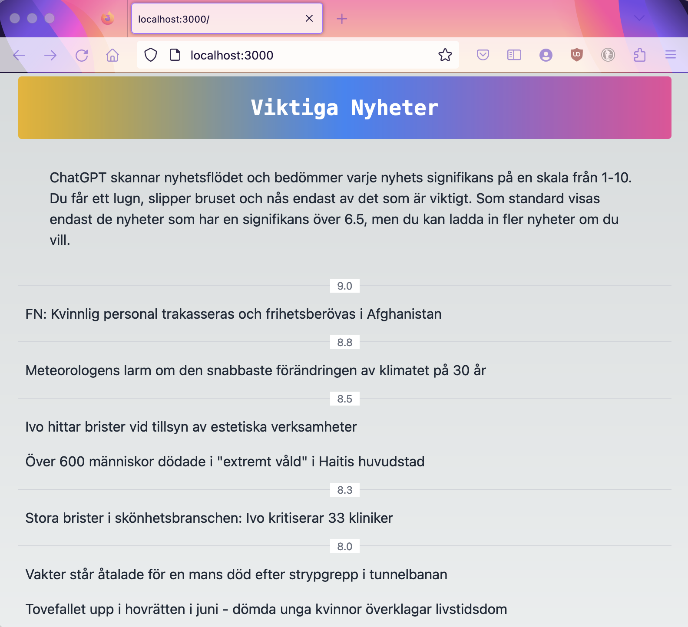

# Viktiganyheter [(Link)](https://viktiganyheter.mansandersson.io)

Website that uses OpenAI API to rate the significance of news articles on a scale of 1-10.
News items are presented in order of significance, with links to the original article.

## Backend
Run `node backend/main.js` to generate the ratings. This will include articles from the last 24 hours.
Result is news.json containing the data that the frontend needs.

## Frontend
Move the news.json file to the frontend directory. Run `npm run dev` in frontend directory to start a development server on localhost:3000.

## Site
Site is currently running live on [viktiganyheter.mansandersson.io](https://viktiganyheter.mansandersson.io)

## Technologies
Next.js and Tailwind

